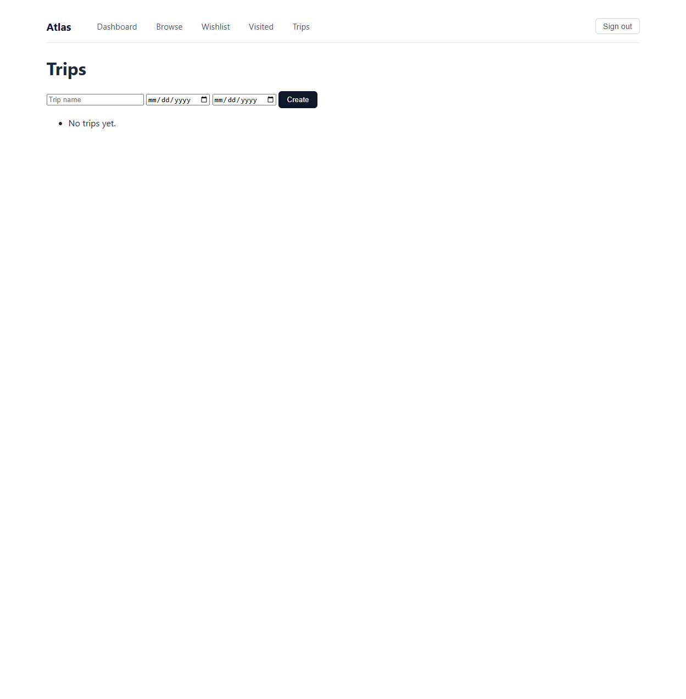

# Atlas Travel Planner

A Flask travel planner built for my University of Maryland capstone. It brings country information, saved places, and multi-city itineraries into one application.

Users can create an account, keep a wishlist and travel journal, arrange trip stops, and export a trip brief as Markdown.



## Stack and design

- **Python, Flask, Jinja:** routes, forms, and server-rendered pages.
- **SQLite:** accounts, saved places, trips, and stops.
- **MongoDB:** cached responses from external travel-data services.
- **Flask-WTF and Werkzeug:** CSRF protection and password hashing.

SQLite holds the user's records; MongoDB holds replaceable travel data. Country, currency, climate, advisory, and Wikivoyage clients each handle their own cache refreshes. Some failures fall back to cached data.

The [walkthrough](docs/walkthrough.md) follows a trip request through the application and explains the database and access-control choices.

## Run the tests first

Requires Python 3.11+. From the repository root:

```sh
python -m venv .venv
# Windows: .venv\Scripts\Activate.ps1
# macOS/Linux: source .venv/bin/activate
python -m pip install -r requirements-dev.txt
python -m pytest
```

The default suite uses a temporary SQLite database, an in-memory MongoDB substitute, and supplied HTTP responses. It blocks network sockets and needs no API keys or running database server. Two optional live MongoDB checks are skipped by default.

Tests cover cache behavior, authentication, trip ownership, CSRF tokens, repositories, and trip briefs. These are regression checks for specific behavior, not a complete security audit.

## Run the app

Activate the environment above and copy `.env.example` to `.env`. Set a random `FLASK_SECRET_KEY` and a `MONGODB_URI` for your local or hosted MongoDB instance.

```sh
python -m flask --app app init-db
python -m scripts.warm_countries
python -m scripts.load_cities
python -m flask --app app refresh-advisories
python -m flask --app app run
```

Open `http://127.0.0.1:5000` and register an account. The data loaders contact external services; warm the country cache before loading cities and advisories. The example configuration enables debug mode for local development.

The app uses REST Countries, Frankfurter, Open-Meteo Climate, US State Department advisories, Wikivoyage, and GeoNames. Offline tests do not establish that every live source is currently available.

## Code map

```text
atlas/routes/      Request handlers
atlas/repos/       SQLite and MongoDB access
atlas/services/    External data, caching, scoring, and trip briefs
atlas/templates/   Pages and Markdown export
scripts/           Reference-data loaders
tests/             Offline suite and optional database checks
```

## Tradeoffs

- Trips are looked up by both trip ID and the logged-in user ID. CSRF tokens and ownership checks address separate problems.
- Two databases made the distinction between user records and cached documents clear, but add setup work for a small application.
- Climate matching uses monthly averages and a heuristic score. It is not a weather forecast.
- The next improvement would be a small seeded demo dataset so someone can explore the UI before downloading live data.

To run the optional database checks, set `ATLAS_TEST_MONGODB_URI` to a dedicated test server and use `python -m pytest --run-live-mongo -m live_mongo`.

## License

[MIT](LICENSE).
